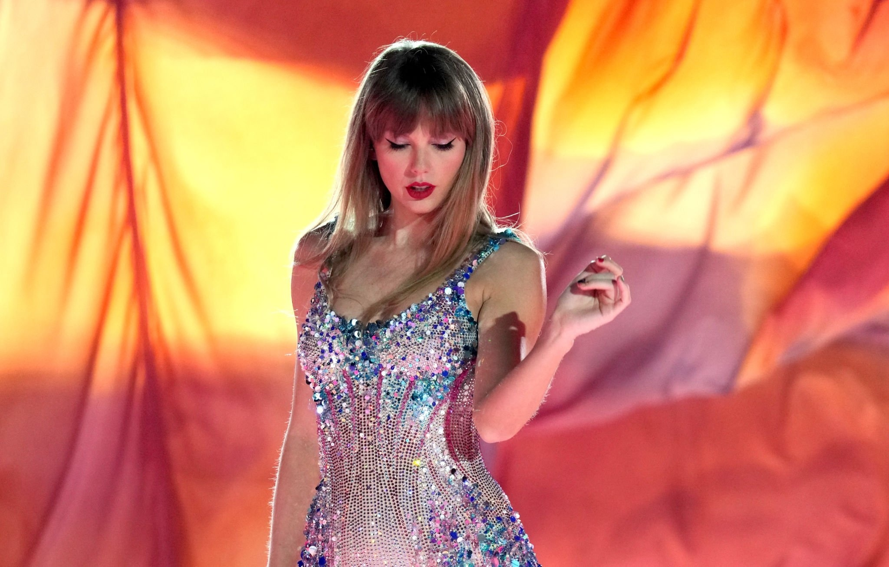
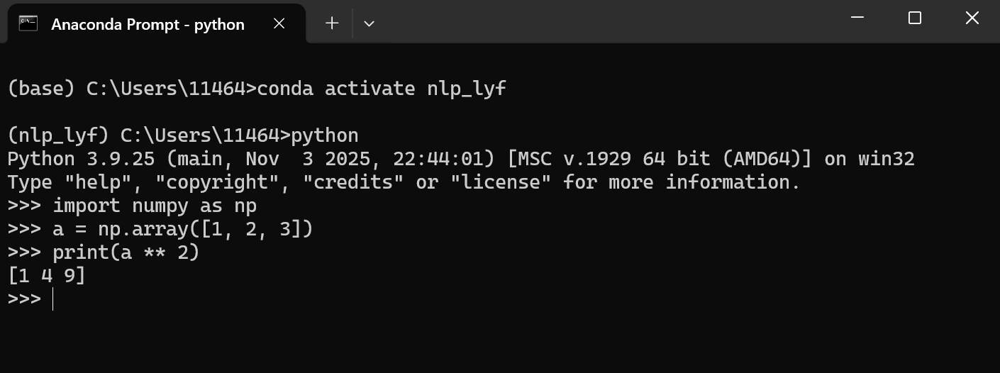
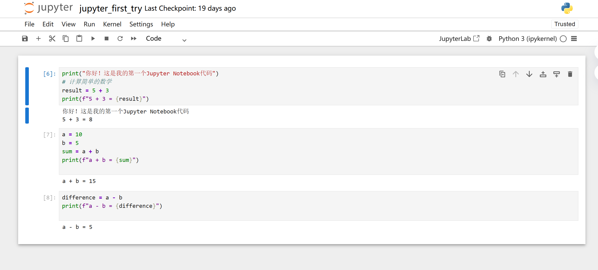

# Taylor Swift 的自我介绍

大家好，我是**Taylor Swift**，我的身份是*美国创作型歌手、词曲作者、音乐制作人*。以下是我的自我介绍：

---

## 基础档案
### 外貌特征
- 标志性金色长卷发
- 经典复古红唇
- 身形高挑优雅
- 舞台气质灵动

### 我的好朋友
1. Selena Gomez
2. Blake Lively
3. ~~Karlie Kloss~~

### 重要坐标
- 住址：[美国纳什维尔](sslocal://flow/file_open?url=https%3A%2F%2Fbaike.baidu.com%2Fitem%2F%E7%BA%B3%E4%BB%80%E7%BB%B4%E5%B0%94&flow_extra=eyJsaW5rX3R5cGUiOiJjb2RlX2ludGVycHJldGVyIn0=)

### 日常作息表
| 时间 | 核心事项 |
|------|----------|
| 9:00 | 词曲创作、灵感整理 |
| 14:00 | 录音棚录制/后期制作 |
| 17:00 | 舞台排练/形体训练 |
| 22:00 | 休息/阅读充电 |

### 人生信条
> 勇敢做自己，每一段经历都值得被写成歌。

---

## 我的专业是人工智能

## 我最喜欢的一段代码
## 本课程专用虚拟环境：nlp_lyf
import numpy as np
a = np.array([1, 2, 3])
print(a ** 2)
其中执行 print(a ** 2) 可输出结果 [1 4 9]。

## 我在 Anaconda Prompt 中激活环境并运行代码：

## 这是我在 Jupyter 中完成的基础代码作业：

